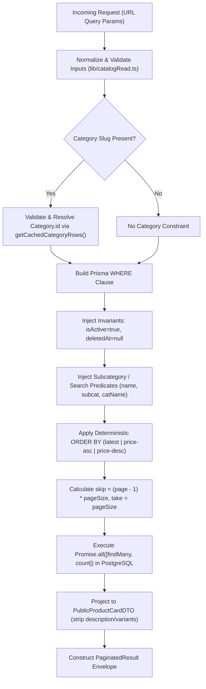

# Phase 5 — Catalog Scalability Design Specification
**Pure Haven BD**
**Date:** 2026-08-28
**Status:** LOCKED SPECIFICATION — Amended After Owner Review
**Git Baseline:** `7259f807c4d8b458d8fd93344471c48f437c0f51` (`phase4-complete`)

---

## 1. Background & Objective

Phase 1 established admin security boundaries. Phase 2 delivered the core commerce engine (inventory reservations, order lifecycle, payment records, returns). Phase 3 established customer authentication and session management. Phase 4 consolidated all persistent business state onto PostgreSQL, introduced relational Category/Subcategory models, Decimal monetary precision, database check constraints, and product lifecycle fields (`isActive`, `deletedAt`).

However, the discovery audit of the catalog subsystem revealed architectural scalability bottlenecks:

1. **Unbounded Database Reads**: Both public catalog (`/shop`, `app/page.tsx`) and admin catalog (`/admin/products`) perform unpaginated `prisma.product.findMany()` queries, loading all active database rows into Node.js server memory on every request.
2. **In-Memory Filtering & Sorting**: Category filtering, subcategory filtering, substring search, and price sorting are executed in JavaScript memory on the server or client rather than within PostgreSQL.
3. **Client-Side Slicing**: The customer-facing `/shop` page delivers all matching products in the initial server render payload, and the client component (`LoadMoreProducts.tsx`) merely slices the in-memory array by 12.
4. **Payload Overfetch**: Catalog list queries pull large fields (`description`) and admin lists pull complete variant trees (`ProductVariant[]`), leading to bloated payload sizes and excessive memory pressure.
5. **Homepage Thumbnail Dependencies**: The homepage queries all active products to resolve fallback category and subcategory images for `CategorySection`.

Phase 5 establishes a **scalable, server-authoritative catalog architecture** for commercial workloads while preserving all locked security, inventory, financial, and relational invariants from Phases 1–4.

---

## 2. Owner-Locked Decisions (D1 – D9)

The following architectural decisions are locked by product ownership and govern the entire Phase 5 design:

### D1 — Public Catalog Loading & UX
- **Customer UX**: Progressive "Load More" button interaction (NOT endless/uncontrolled infinite scroll).
- **Initial Chunk**: 24 products rendered on first load.
- **Increment Chunk**: +24 products appended per "Load More" click.
- **Underlying Server Contract**: Strictly bounded page-based pagination (`page`, `pageSize`).
- **Server/API Hard Limit**: Hard maximum `pageSize = 48` enforced server-side.
- **State Recovery**: Category, search, subcategory, sort, and progressive page state must remain deterministic, bookmarkable, and recoverable via browser history without issuing unbounded database queries.
- **Performance Model**: The design explicitly acknowledges that SQL `OFFSET` pagination scans preceding index entries before slicing results. While deep `OFFSET` queries have increasing database scan costs compared to keyset cursors, bounded offset pagination is the optimal engineering trade-off for Pure Haven's catalog scale (< 50,000 products), offering superior SEO, URL shareability, and multi-field sorting flexibility.

### D2 — Public Sort Options
The public catalog supports exactly three sorting options:
1. `latest` (Default): Ordered by `id DESC` (deterministic tiebreaker).
2. `price-asc` (Price: Low to High): Ordered by `price ASC, id DESC`.
3. `price-desc` (Price: High to Low): Ordered by `price DESC, id DESC`.

*No popularity, best-selling, or alphabetical name sorts will be introduced in Phase 5.*

### D3 — Public Search Scope
- **Fields Searched**: Server-side filtering across `Product.name`, relational `Category.name`, and `Product.subcategory`.
- **Exclusions**: `Product.description` is **strictly excluded** from search indexing and query matching in Phase 5.
- **Infrastructure Constraints**: No external search engines (Elasticsearch, Algolia, Meilisearch), no semantic/AI search, and no variant SKU search in Phase 5.
- **Indexing Reality**: The design acknowledges that standard B-tree indexes do not optimize arbitrary leading-wildcard `%term%` `ILIKE` pattern scans; search execution is handled via parameterized server-side SQL predicates.

### D4 — Admin Product Catalog Scalability
- `/admin/products` adopts server-side pagination, search, and filtering.
- **Default Page Size**: 20 products per page.
- **Maximum Page Size**: 50 products per page.
- **Variant Overfetch Elimination**: Admin list queries (`AdminProductListDTO`) will **not** load full variant arrays for every product. Full variant trees are loaded on-demand only when editing or viewing individual product details.

### D5 — Category & Subcategory Navigation UX
- Selecting a parent category immediately displays all products belonging to that category.
- Subcategory selection acts as an **optional refinement filter**.
- The legacy behavior requiring the customer to choose a subcategory before seeing products is completely removed:
  - `/shop?category=skincare` → Displays all Skincare products.
  - `/shop?category=skincare&subcategory=serum` → Displays Skincare products refined to Serum.

### D6 — Pagination & Result Metadata Envelope
All paginated catalog endpoints return a standardized metadata envelope:
- `items`: Array of DTO items for the current page.
- `page`: Current 1-indexed page number.
- `pageSize`: Number of items requested per page.
- `totalItems`: Total matching product count.
- `totalPages`: Total available pages (`Math.ceil(totalItems / pageSize)`).
- `hasMore`: Boolean flag (`page < totalPages`).
- `nextPage`: Next page number (`page + 1`) or `null` if on the final page.
- *Execution Model*: The count query is executed via `prisma.product.count({ where })` concurrently alongside `findMany` using `Promise.all` (two concurrent database queries, not a single round-trip).

### D7 — Read Model & DTO Separation
Clear separation between specialized DTO contracts:
1. `PublicProductCardDTO`: Lightweight card projection (no `description`, no `variants[]`).
2. `PublicProductDetailDTO`: Complete detail projection for product detail pages (includes `description`, active variants only, full images).
3. `AdminProductListDTO`: Lightweight operational list projection with variant summary.
4. `AdminProductDetailDTO`: Complete operational entity with all variants and audit fields for admin editor.

### D8 — Variant Metadata on Public Cards
- `PublicProductCardDTO` includes exactly one variant metadata flag: `hasVariants: boolean`.
- `PublicProductCardDTO` strictly omits: `variantCount`, variant labels, individual variant prices, variant stocks, variant images, and `variants[]`.
- `hasVariants` is computed based on active variants only (`ProductVariant.isActive = true`) via a count/existence projection without loading nested variant arrays.
- *Purpose*: Enables future Phase 8 quick-add vs option-selector UX without payload bloat.

### D9 — Category Relational Authority
- **Public URL**: Slug-based (`?category=skincare`).
- **Server Authority**: Server resolves category slug → `Category.id` → filters SQL via relational `Product.categoryId = Category.id`.
- **Legacy Field**: `Product.category` string is retained solely as a denormalized display snapshot and backward-compatibility field, NOT the authoritative query key.
- **Subcategory**: Retains scoped string/slug matching within the parent category in Phase 5 (no schema migration for `subcategoryId` in Phase 5).

---

## 3. Public Query Architecture



### Execution Flow Details

1. **Input Normalization & Bounds Check**:
   - Extract `page`, `pageSize`, `category`, `subcategory`, `q`, `sort` from `searchParams`.
   - Validate and clamp values. If `page > MAX_PUBLIC_PAGE` (10,000), reject with HTTP 400.
2. **Category Resolution**:
   - If `category` slug is provided, validate slug syntax against `/^[a-z0-9]+(?:-[a-z0-9]+)*$/`.
   - Look up `Category` in cached category tree (`getCachedCategoryRows(false)`).
   - If category slug is not found or invalid, return empty results immediately (`totalItems: 0`, `items: []`).
   - If category is found, set `where.categoryId = category.id`.
3. **Where Clause Construction**:
   - Enforce mandatory lifecycle boundaries: `where.isActive = true` and `where.deletedAt = null`.
   - If `subcategory` slug is provided, validate syntax and set `where.subcategory = { equals: subcategorySlug, mode: "insensitive" }`.
   - If search query `q` is present:
     ```ts
     where.OR = [
       { name: { contains: sanitizedQuery, mode: "insensitive" } },
       { subcategory: { contains: sanitizedQuery, mode: "insensitive" } },
       { categoryRel: { name: { contains: sanitizedQuery, mode: "insensitive" } } },
     ];
     ```
4. **Deterministic Sorting**:
   - `latest`: `orderBy: [{ id: "desc" }]`
   - `price-asc`: `orderBy: [{ price: "asc" }, { id: "desc" }]`
   - `price-desc`: `orderBy: [{ price: "desc" }, { id: "desc" }]`
5. **Database Execution**:
   - Query 1: `prisma.product.findMany({ where, orderBy, skip, take, select: cardProjection })`
   - Query 2: `prisma.product.count({ where })`
   - Dispatched concurrently via `Promise.all([findManyTask, countTask])`.

---

## 4. Query Parameter & Input Normalization Contract

| Parameter | Type | Validation & Normalization Rules | Default | Maximum Bound |
|---|---|---|---|---|
| `page` | Integer | Parse as base-10 int. If `NaN` or `< 1` → clamp to `1`. If `> 10000` (`MAX_PUBLIC_PAGE`) → return HTTP 400 `INVALID_PAGE`. | `1` | `10000` |
| `pageSize` | Integer | Parse as base-10 int. If `NaN` or `< 1` → default `24`. If `> 48` → clamp to `48`. | `24` | `48` |
| `category` | String | Trim, lowercase, max 100 chars. Must match slug syntax `/^[a-z0-9]+(?:-[a-z0-9]+)*$/`. Invalid format returns empty results (`totalItems: 0`). | `null` | 100 chars |
| `subcategory` | String | Trim, lowercase, max 100 chars. Must match slug syntax `/^[a-z0-9]+(?:-[a-z0-9]+)*$/`. Optional refinement within category. | `null` | 100 chars |
| `q` | String | Trim whitespace, max 80 chars. Parameterized through query layer. Empty after trim → `null` (no search predicate). | `null` | 80 chars |
| `sort` | String | Must match one of `latest`, `price-asc`, `price-desc`. Unknown values normalize to `latest`. | `latest` | Fixed Enum |

### Safety Limits & Error Semantics
- **`MAX_PUBLIC_PAGE = 10_000`**: Requesting `page > 10_000` returns HTTP 400 with `{ success: false, code: "INVALID_PAGE", message: "Requested page exceeds maximum allowed page boundary (10,000)." }`. This prevents pathological `OFFSET` values and integer overflow while supporting catalogs far beyond anticipated size.
- **Out-of-Range Pages**: When `1 <= page <= 10_000` but `page > totalPages` (e.g. `page = 15` when `totalPages = 3`):
  - Server returns HTTP 200 with `{ success: true, items: [], page: 15, pageSize: 24, totalItems: 60, totalPages: 3, hasMore: false, nextPage: null }`.
  - The server **does not silently redirect** or rewrite to page 1 or the last page, maintaining deterministic API contracts.

---

## 5. Customer Load More State & Restoration Contract

### Exact Page State Model
- In the public catalog, `page = N` represents: **"The customer has progressively revealed results through logical page N."**
- Example: `page = 3` with `pageSize = 24` means the customer is viewing products 1 through 72.

### Normal Load More Progression
1. Initial page load renders Page 1 (items 1–24).
2. Customer clicks "Load More".
3. Client issues `GET /api/products?view=public&page=2&pageSize=24&...`.
4. Client receives Page 2 envelope, deduplicates items by `id`, appends them to the visible grid, updates internal state to `page = 2`, and updates the browser URL to `?page=2` via `window.history.pushState` / Next.js router.

### URL Restoration Semantics (Refresh / Back / Forward)
When a customer navigates directly to or refreshes a URL with `page = N` (e.g. `?category=skincare&page=3`):
1. **No Unbounded Overfetch**: The server or client will **NOT** issue one giant `pageSize = N * 24` query that bypasses the `pageSize = 48` limit.
2. **Controlled Page-by-Page Reconstruction**:
   - The server component renders Page 1 (items 1–24) immediately.
   - If `N > 1` (and `N <= MAX_RESTORE_PAGES`), the client progressively fetches pages `2..N` in bounded `pageSize = 24` requests, merging and deduplicating items into the grid.
3. **Client Restoration Safety Cap**:
   - `MAX_RESTORE_PAGES = 10` (corresponding to 240 products).
   - If a shared or bookmarked URL has `page > MAX_RESTORE_PAGES`, the client restores up to page 10 and prompts the customer with "Load More" to continue, protecting client memory and network bandwidth.
4. **Filter Reset Rule**: Modifying `category`, `subcategory`, `q`, or `sort` immediately resets pagination to `page = 1` and clears previously accumulated items.

---

## 6. DTO Architecture & Field Specifications

### 6.1 PublicProductCardDTO (Minimal Listing Projection)
Used on `/shop` grid, search results, and category listing.

```ts
export type PublicProductCardDTO = {
  id: number;
  name: string;
  price: number;              // Formatted from Decimal for presentation
  compareAtPrice: number | null;
  image: string;
  category: string;           // Display category name snapshot
  stock: number;              // Aggregate mirror stock
  isHotDeal: boolean;
  isUpcoming: boolean;
  badgeText: string | null;
  badgeTone: string;
  hasVariants: boolean;       // D8: Computed from active variants without loading variants[]
};
```
*Strictly Excluded*: `description`, `variants[]`, `createdAt`, `updatedAt`, `deletedAt`, `isActive`.

### 6.2 PublicProductDetailDTO (Complete PDP Projection)
Used on `/product/[id]` detail page. Requires `isActive = true` and `deletedAt = null`.

```ts
export type PublicProductVariantDTO = {
  id: number;
  label: string;
  price: number;
  stock: number;
  image: string | null;
};

export type PublicProductDetailDTO = PublicProductCardDTO & {
  categoryId: number | null;
  subcategory: string | null;
  description: string | null;
  variants: PublicProductVariantDTO[]; // Active variants only
};
```

### 6.3 AdminProductListDTO (Lightweight Admin Dashboard Projection)
Used on `/admin/products` list table.

```ts
export type AdminProductListDTO = {
  id: number;
  name: string;
  price: number;
  compareAtPrice: number | null;
  image: string;
  category: string;
  categoryId: number | null;
  subcategory: string | null;
  stock: number;
  isHotDeal: boolean;
  isUpcoming: boolean;
  badgeText: string | null;
  badgeTone: string;
  isActive: boolean;
  createdAt: string;          // ISO Date string
  variantCount: number;       // Count of active variants (no full variant arrays)
  hasVariants: boolean;
};
```
*Strictly Excluded*: `description`, full `variants[]` records.

### 6.4 AdminProductDetailDTO (Full Admin Editor Projection)
Used when opening product editor modal or `/admin/products/[id]/edit`.

```ts
export type AdminProductVariantDTO = {
  id: number;
  productId: number;
  label: string;
  price: number;
  stock: number;
  image: string | null;
  isActive: boolean;
  sortOrder: number;
};

export type AdminProductDetailDTO = AdminProductListDTO & {
  description: string | null;
  deletedAt: string | null;
  updatedAt: string;
  variants: AdminProductVariantDTO[]; // All variants (active and inactive) for editing
};
```

### 6.5 Monetary Precision & Authority Boundary
- **Database Authority**: PostgreSQL `DECIMAL(12, 2)` / Prisma `Decimal` is the **sole source of financial truth**.
- **DTO Transport**: JavaScript `Number` in DTOs is strictly for JSON transport and UI display. Binary floating-point representation has **zero monetary authority**.
- **Checkout & Inventory Boundary**: Catalog DTO values must **NEVER** be reused as checkout, payment, or inventory authority. During checkout (`POST /api/orders`), the server executes fresh transactional queries to re-read and validate authoritative Decimal prices and stock.

---

## 7. Admin Query Architecture

### Admin List Endpoint Specification
- **Route**: `GET /api/products?view=admin&page=1&pageSize=20&q=...&filter=...`
- **Authentication**: Strictly protected by `requireAdmin(req)`. Unauthenticated calls return HTTP 401.
- **Default Pagination**: `pageSize = 20`, maximum `pageSize = 50`, `MAX_ADMIN_PAGE = 10_000`.
- **Server-Side Filters**:
  - `filter=hot` → `where.isHotDeal = true`
  - `filter=upcoming` → `where.isUpcoming = true`
  - `filter=discount` → **Locked Exact Predicate**: `compareAtPrice IS NOT NULL AND compareAtPrice > price`. Implementation uses a parameter-safe query strategy (such as a safe Prisma comparison or parameterized SQL filter) that guarantees this exact business predicate.
  - `filter=badge` → `where.badgeText = { not: null }`
  - `q=...` → Parameterized match across `name`, `category`, `subcategory`, or integer `id`.
- **Query Optimization**: Admin list uses `select` omitting `description` and counts active variants via `_count: { select: { variants: { where: { isActive: true } } } }` without joining or loading variant records.
- **Detail on Demand**: When the admin clicks "Edit", the client issues `GET /api/products?view=admin&id=123` to retrieve the complete `AdminProductDetailDTO`.

---

## 8. Database Index Strategy

All listed indexes are classified as **CANDIDATES** to be evaluated against PostgreSQL query plans (`EXPLAIN ANALYZE`) on a test database during implementation.

### 8.1 Existing Baseline Indexes (Preserved)
- `Product`: `PRIMARY KEY (id)`
- `Product`: `@@index([isActive, deletedAt])`
- `Product`: `@@index([categoryId])`
- `ProductVariant`: `PRIMARY KEY (id)`
- `ProductVariant`: `@@index([productId, isActive])`
- `Category`: `PRIMARY KEY (id)`, `@@unique([slug])`
- `Subcategory`: `PRIMARY KEY (id)`, `@@unique([categoryId, slug])`

### 8.2 Candidate Composite Index Families

The implementation will evaluate the following candidate index families:

1. **Active/Non-Deleted Default Ordering**:
   - `@@index([isActive, deletedAt, id(sort: Desc)])`
   - *Target Query*: Global `/shop` and search sorted by `latest`.
2. **Relational Category + Default Ordering**:
   - `@@index([categoryId, isActive, deletedAt, id(sort: Desc)])`
   - *Target Query*: `/shop?category=skincare` sorted by `latest`.
3. **Global Active/Non-Deleted Price Ordering**:
   - `@@index([isActive, deletedAt, price(sort: Asc), id(sort: Desc)])`
   - `@@index([isActive, deletedAt, price(sort: Desc), id(sort: Desc)])`
   - *Target Query*: Global `/shop?sort=price-asc` or `price-desc`. Note: Global price sorting requires a different index shape than category-filtered price sort.
4. **Relational Category + Price Ordering**:
   - `@@index([categoryId, isActive, deletedAt, price(sort: Asc), id(sort: Desc)])`
   - `@@index([categoryId, isActive, deletedAt, price(sort: Desc), id(sort: Desc)])`
   - *Target Query*: `/shop?category=skincare&sort=price-asc`.

### 8.3 Index Validation Requirements
- The implementation must inspect real PostgreSQL query plans before committing migrations.
- Only indexes that measurably reduce cost or eliminate sort buffers will be added.
- Proliferation of redundant indexes must be avoided.
- Trigram indexing (`pg_trgm`) remains optional and deferred; standard parameterized SQL predicates are used for search in Phase 5.

---

## 9. Locked Phase 1–4 Invariants (Non-Negotiable)

The implementation of Phase 5 must strictly guarantee that zero existing security, lifecycle, or financial guarantees are altered:

1. **Admin Authorization Boundary**:
   - All catalog mutations (`POST /api/products`, `PUT /api/products`, `PATCH /api/products`, `DELETE /api/products`, and `/api/categories` mutations) and admin read views (`?view=admin`) require valid admin authentication via `requireAdmin(req)`.
2. **Product Lifecycle Safety**:
   - Inactive products (`isActive = false`) and soft-deleted products (`deletedAt != null`) are **never** returned in public catalog lists, searches, category views, or Load More responses.
   - Products with historical `OrderItem` references are protected against hard deletion; deleting such a product triggers a safe soft-delete transaction.
3. **Inventory Reservation Delete Guards**:
   - A product or variant cannot be deleted if active `RESERVED` or `FULFILLED` inventory reservations exist. Attempts return HTTP 409 `PRODUCT_RESERVED_ACTIVE` or `VARIANT_RESERVED_ACTIVE`.
4. **Authoritative Inventory Model**:
   - `ProductVariant.stock` is authoritative for variant inventory.
   - `Product.stock` is the aggregate mirror for variant products and is maintained via transactional atomic increments/decrements.
   - `Product.stock` is authoritative for non-variant products.
   - Stock cannot be modified through product metadata updates (`PUT /api/products` preserves live database stock).
5. **Decimal Financial Authority**:
   - Monetary values in PostgreSQL are stored as exact `DECIMAL(12, 2)`.
   - Prices submitted from clients are normalized and validated via `lib/money.ts` (`requireNonNegativeMoney`).
6. **Checkout Independence**:
   - Catalog DTOs are unprivileged read projections. During checkout (`POST /api/orders`), the server executes fresh transactional lookups directly against PostgreSQL to validate live stock and authoritative prices.

---

## 10. Homepage Bounded Read Architecture

The discovery audit revealed that `app/page.tsx` loaded all active products to support three components: `HomePromoGrid` (New Arrivals, Hot Deals), `CategorySection` (category and subcategory banner thumbnails), and `Navbar`.

### Bounded Query Design for Homepage

1. **New Arrivals**:
   - Target query: `prisma.product.findMany({ where: { isActive: true, deletedAt: null }, orderBy: [{ createdAt: "desc" }], take: 1, select: { id: true, name: true, image: true } })`.
2. **Hot Deals**:
   - Target query: `prisma.product.findFirst({ where: { isActive: true, deletedAt: null, isHotDeal: true }, orderBy: [{ id: "desc" }], select: { id: true, name: true, image: true } })`.
3. **Category Banner Thumbnails**:
   - Uses `Category.image` directly from the cached category tree (`getCachedCategoryRows(false)`).
4. **Subcategory Banner Thumbnails**:
   - Uses a **dedicated batched bounded query** rather than loading all products.
   - Example strategy: Execute a single batched query fetching the first available product image per active subcategory (e.g. `prisma.product.findMany({ where: { isActive: true, deletedAt: null, subcategory: { not: null } }, distinct: ['categoryId', 'subcategory'], select: { categoryId: true, subcategory: true, image: true } })`), or resolve via static category fallback images.
5. **Invariant**: The homepage must **never** load the full product table to render thumbnails or promotional tiles.

---

## 11. Explicit API Route Contracts

There is **exactly one** unambiguous contract for each API path:

### A. Public Paginated Product List
- **Endpoint**: `GET /api/products?view=public&page=1&pageSize=24&category=...&subcategory=...&q=...&sort=...`
- **Fallback**: If `view` parameter is omitted, it defaults to `view=public` with standard pagination (`page=1`, `pageSize=24`). It **never** returns an unbounded catalog array.
- **Response**:
  ```json
  {
    "success": true,
    "items": [ /* PublicProductCardDTO[] */ ],
    "page": 1,
    "pageSize": 24,
    "totalItems": 120,
    "totalPages": 5,
    "hasMore": true,
    "nextPage": 2
  }
  ```

### B. Public Product Detail
- **Endpoint**: `GET /api/products?id=<id>` (without `view=admin`)
- **Authentication**: Unauthenticated.
- **Enforcement**: Must enforce `isActive = true`, `deletedAt = null`, and return active variants only. If product is inactive or deleted, returns HTTP 404.
- **Response**:
  ```json
  {
    "success": true,
    "product": { /* PublicProductDetailDTO */ }
  }
  ```

### C. Admin Paginated Product List
- **Endpoint**: `GET /api/products?view=admin&page=1&pageSize=20&filter=...&q=...`
- **Authentication**: Required (`requireAdmin`). Unauthenticated returns HTTP 401.
- **Response**:
  ```json
  {
    "success": true,
    "items": [ /* AdminProductListDTO[] */ ],
    "page": 1,
    "pageSize": 20,
    "totalItems": 85,
    "totalPages": 5,
    "hasMore": true,
    "nextPage": 2
  }
  ```

### D. Admin Product Detail
- **Endpoint**: `GET /api/products?view=admin&id=<id>`
- **Authentication**: Required (`requireAdmin`). Unauthenticated returns HTTP 401.
- **Response**:
  ```json
  {
    "success": true,
    "product": { /* AdminProductDetailDTO */ }
  }
  ```

---

## 12. Test Strategy & TDD Roadmap

A comprehensive test suite will be written using Node.js native test runner (`tsx --test`) and real PostgreSQL integration tests before any production code changes:

### Required Phase 5 Test Coverage

1. **Pagination Engine**:
   - `test/pagination-defaults`: Requesting without `page` returns page 1 with 24 items.
   - `test/pagination-next-page`: Requesting `page=2` returns items 25–48 with zero overlap with page 1.
   - `test/pagination-bounds`: Requesting `pageSize=500` clamps to `pageSize=48`.
   - `test/pagination-invalid-params`: Requesting `page=-3` or `page=abc` normalizes safely to `page=1`.
   - `test/pagination-max-page-rejection`: Requesting `page=10001` returns HTTP 400 `INVALID_PAGE`.
   - `test/pagination-out-of-range`: Requesting `page=999` (where totalPages = 3) returns empty `items: []`, `hasMore: false`, and accurate `totalItems`.
2. **Deterministic Ordering**:
   - `test/sort-latest`: Verifies `id DESC` order.
   - `test/sort-price-asc`: Verifies `price ASC` with `id DESC` tiebreaker for identical prices.
   - `test/sort-price-desc`: Verifies `price DESC` with `id DESC` tiebreaker.
3. **Server-Side Filtering**:
   - `test/filter-category-relational`: Verifies filtering by category slug resolves `Category.id` and queries `Product.categoryId`.
   - `test/filter-subcategory`: Verifies subcategory refinement within category.
   - `test/filter-category-products-immediate`: Verifies selecting parent category displays all child products without requiring subcategory.
4. **Server-Side Search**:
   - `test/search-scope`: Verifies matching `Product.name`, `Category.name`, and `Product.subcategory`.
   - `test/search-description-excluded`: Verifies terms found only in `Product.description` are NOT returned in search.
5. **DTO Contract & Overfetch Prevention**:
   - `test/card-dto-shape`: Asserts `PublicProductCardDTO` contains `hasVariants` (computed from active variants) and strictly lacks `description` and `variants[]`.
   - `test/admin-list-dto-shape`: Asserts `AdminProductListDTO` contains `variantCount` and does not load nested `ProductVariant[]` arrays.
6. **Admin Discount Filter**:
   - `test/admin-discount-filter`: Asserts `filter=discount` matches strictly `compareAtPrice IS NOT NULL AND compareAtPrice > price`.
7. **Lifecycle & Invariant Security**:
   - `test/lifecycle-exclusion`: Verifies `isActive = false` and `deletedAt != null` items never appear in catalog or search.
   - `test/admin-auth-enforcement`: Verifies unauthorized calls to admin catalog endpoints return 401.
   - `test/decimal-preservation`: Verifies prices retain exact decimal fidelity.

---

## 13. Scale & Qualitative Risk Assessment

| Catalog Scale | Architectural Risk Under Current Baseline | Architectural Risk Under Phase 5 Design | Qualitative Technical Rationale |
|---|---|---|---|
| **100 Products** | 🟢 **LOW RISK** | 🟢 **OPTIMAL** | The baseline system functions adequately with 100 products. Phase 5 streamlines query projection and removes redundant memory allocations. |
| **1,000 Products** | 🟡 **MODERATE RISK** | 🟢 **OPTIMAL** | Under the baseline, transferring all 1,000 product rows on every page load causes noticeable JSON serialization latency and browser payload bloat. Phase 5 restricts server reads to bounded 24-product slices regardless of total catalog size. |
| **10,000 Products** | 🔴 **HIGH RISK** | 🟢 **SCALABLE** | Under the baseline, unpaginated table scans across 10,000 products cause severe memory pressure, database connection starvation, and mobile DOM freezing. Phase 5 utilizes candidate composite indexes and server-side limit/offset queries to fetch only requested slices. |

### Note on Deep OFFSET Pagination Cost
The design explicitly preserves the understanding that SQL `OFFSET` requires the database engine to scan preceding rows before slicing the page. However, with indexed range scans and the `MAX_PUBLIC_PAGE = 10_000` bound, this cost remains well within acceptable operational parameters for Pure Haven's catalog scale while delivering superior URL shareability and SEO benefits over opaque cursors.

---

## 14. Explicit Phase Boundaries

```
┌───────────────────────────────────────────────────────────────────────────┐
│                        PHASE 5 — CATALOG SCALABILITY                      │
│  • Server-side bounded pagination (take / skip / count)                   │
│  • Bounded progressive Load More data contracts (initial 24, +24)          │
│  • Server-authoritative filtering (category slug -> ID, subcategory, q)   │
│  • Deterministic sorting (latest, price-asc, price-desc with ID tiebreaker)│
│  • Card DTO & Admin DTO separation (strip description / variants[])       │
│  • Query-proven candidate composite database indexes                      │
│  • Admin product list pagination & lightweight projections                │
│  • Bounded homepage catalog queries                                       │
└───────────────────────────────────────────────────────────────────────────┘
                                     │
                                     ▼ DEFERRED
┌───────────────────────────────────────────────────────────────────────────┐
│ PHASE 6: Image & Media Infrastructure (Cloudinary/S3, WebP pipelines)     │
├───────────────────────────────────────────────────────────────────────────┤
│ PHASE 7: Performance Engineering (Distributed Redis cache, ISR tagging)   │
├───────────────────────────────────────────────────────────────────────────┤
│ PHASE 8: Premium Shopping UX (Faceted filter drawers, quick-view modals)   │
├───────────────────────────────────────────────────────────────────────────┤
│ PHASE 9: Checkout & Post-Purchase UX Overhaul                             │
└───────────────────────────────────────────────────────────────────────────┘
```

---

## 15. Spec Self-Review Checklist

- [x] All unmeasured quantitative performance numbers removed; qualitative risk language used exclusively.
- [x] Unambiguous API contracts defined for Public List, Public Detail, Admin List, and Admin Detail (no "or" contracts).
- [x] Load More state and progressive URL restoration semantics locked with client safety cap (`MAX_RESTORE_PAGES = 10`).
- [x] Server-side safety limit locked (`MAX_PUBLIC_PAGE = 10_000`, `MAX_ADMIN_PAGE = 10_000` with HTTP 400 rejection).
- [x] Admin discount filter locked to exact predicate `compareAtPrice IS NOT NULL AND compareAtPrice > price`.
- [x] Database indexes reclassified as candidates subject to real PostgreSQL query-plan inspection; global price sort vs category price sort distinguished.
- [x] Homepage bounded query architecture addresses New Arrivals, Hot Deals, Category thumbnails, and batched subcategory thumbnail reads.
- [x] `hasVariants` and `variantCount` computed on active variants without loading full variant arrays or introducing N+1 queries.
- [x] Input validation specifies exact slug regex and boundary rules.
- [x] Decimal monetary precision and checkout independence explicitly reinforced.
- [x] Exact alignment with owner-locked decisions D1 through D9 maintained.
- [x] Zero application/runtime code, Prisma schema, migrations, tests, or databases modified.

---

**Specification Locked By**: Antigravity Agent & Pure Haven BD Engineering  
**Next Step**: Await user confirmation to proceed to Phase 5 implementation planning.
