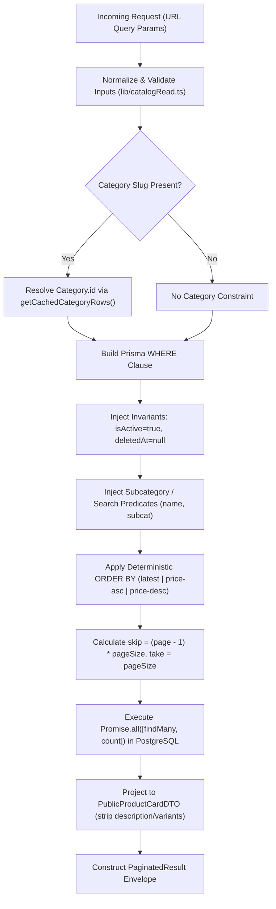

# Phase 5 — Catalog Scalability Design Specification
**Pure Haven BD**
**Date:** 2026-08-28
**Status:** LOCKED SPECIFICATION — Ready for Owner Review
**Git Baseline:** `7259f807c4d8b458d8fd93344471c48f437c0f51` (`phase4-complete`)

---

## 1. Background & Objective

Phase 1 established admin security boundaries. Phase 2 delivered the core commerce engine (inventory reservations, order lifecycle, payment records, returns). Phase 3 established customer authentication and session management. Phase 4 consolidated all persistent business state onto PostgreSQL, introduced relational Category/Subcategory models, Decimal monetary precision, database check constraints, and product lifecycle fields (`isActive`, `deletedAt`).

However, the discovery audit of the catalog subsystem revealed architectural scalability bottlenecks:

1. **Unbounded Database Reads**: Both public catalog (`/shop`, `app/page.tsx`) and admin catalog (`/admin/products`) perform unpaginated `prisma.product.findMany()` queries, loading all active database rows into Node.js server memory on every request.
2. **In-Memory Filtering & Sorting**: Category filtering, subcategory filtering, substring search, and price sorting are executed in JavaScript memory on the server or client rather than within PostgreSQL.
3. **Client-Side Slicing**: The customer-facing `/shop` page delivers all matching products in the initial server render payload, and the client component (`LoadMoreProducts.tsx`) merely slices the in-memory array by 12.
4. **Payload Overfetch**: Catalog list queries pull large fields (`description`) and admin lists pull complete variant trees (`ProductVariant[]`), leading to bloated payload sizes and excessive memory pressure.

Phase 5 will establish a **scalable, server-authoritative catalog architecture** for commercial workloads while preserving all locked security, inventory, financial, and relational invariants from Phases 1–4.

---

## 2. Owner-Locked Decisions (D1 – D9)

The following architectural decisions are locked by product ownership and govern the entire Phase 5 design:

### D1 — Public Catalog Loading & UX
- **Customer UX**: Progressive "Load More" button interaction (NOT endless/uncontrolled infinite scroll).
- **Initial Chunk**: 24 products rendered on first load.
- **Increment Chunk**: +24 products appended per "Load More" click.
- **Underlying Server Contract**: Strictly bounded page-based pagination (`page`, `pageSize`).
- **Server/API Hard Limit**: Hard maximum `pageSize = 48` enforced server-side.
- **State Recovery**: Category, search, subcategory, sort, and page state must remain deterministic, bookmarkable, and recoverable via browser history.
- **Performance Model**: The design explicitly acknowledges that SQL `OFFSET` pagination scans preceding index entries before slicing results. While deep `OFFSET` queries have increasing database scan costs compared to keyset cursors, bounded offset pagination is the optimal engineering trade-off for Pure Haven's catalog scale (< 50,000 products), offering superior SEO, URL shareability, and multi-field sorting flexibility.

### D2 — Public Sort Options
The public catalog supports exactly three sorting options:
1. `latest` (Default): Ordered by `id DESC` (deterministic tiebreaker).
2. `price-asc` (Price: Low to High): Ordered by `price ASC, id DESC`.
3. `price-desc` (Price: High to Low): Ordered by `price DESC, id DESC`.

*No popularity, best-selling, or alphabetical name sorts will be introduced in Phase 5.*

### D3 — Public Search Scope
- **Fields Searched**: Server-side filtering across `Product.name`, relational `Category.name`, and `Product.subcategory`.
- **Exclusions**: `Product.description` is **strictly excluded** from search indexing and query matching in Phase 5.
- **Infrastructure Constraints**: No external search engines (Elasticsearch, Algolia, Meilisearch), no semantic/AI search, and no variant SKU search in Phase 5.
- **Indexing Reality**: The design acknowledges that standard B-tree indexes do not optimize arbitrary leading-wildcard `%term%` `ILIKE` pattern scans; search execution is handled via parameterized server-side SQL predicates.

### D4 — Admin Product Catalog Scalability
- `/admin/products` adopts server-side pagination, search, and filtering.
- **Default Page Size**: 20 products per page.
- **Maximum Page Size**: 50 products per page.
- **Variant Overfetch Elimination**: Admin list queries (`AdminProductListDTO`) will **not** load full variant arrays for every product. Full variant trees are loaded on-demand only when editing or viewing individual product details.

### D5 — Category & Subcategory Navigation UX
- Selecting a parent category immediately displays all products belonging to that category.
- Subcategory selection acts as an **optional refinement filter**.
- The legacy behavior requiring the customer to choose a subcategory before seeing products is completely removed:
  - `/shop?category=skincare` → Displays all Skincare products.
  - `/shop?category=skincare&subcategory=serum` → Displays Skincare products refined to Serum.

### D6 — Pagination & Result Metadata Envelope
All paginated catalog endpoints return a standardized metadata envelope:
- `items`: Array of DTO items for the current page.
- `page`: Current 1-indexed page number.
- `pageSize`: Number of items requested per page.
- `totalItems`: Total matching product count.
- `totalPages`: Total available pages (`Math.ceil(totalItems / pageSize)`).
- `hasMore`: Boolean flag (`page < totalPages`).
- `nextPage`: Next page number (`page + 1`) or `null` if on the final page.
- *Execution Model*: The count query is executed via `prisma.product.count({ where })` concurrently alongside `findMany` using `Promise.all` (two concurrent database queries, not a single round-trip).

### D7 — Read Model & DTO Separation
Clear separation between specialized DTO contracts:
1. `PublicProductCardDTO`: Lightweight card projection (no `description`, no `variants[]`).
2. `PublicProductDetailDTO`: Complete detail projection for product detail pages (includes `description`, active variants, full images).
3. `AdminProductListDTO`: Lightweight operational list projection with variant summary.
4. `AdminProductDetailDTO`: Complete operational entity with all variants and audit fields for admin editor.

### D8 — Variant Metadata on Public Cards
- `PublicProductCardDTO` includes exactly one variant metadata flag: `hasVariants: boolean`.
- `PublicProductCardDTO` strictly omits: `variantCount`, variant labels, individual variant prices, variant stocks, variant images, and `variants[]`.
- *Purpose*: Enables future Phase 8 quick-add vs option-selector UX without payload bloat.

### D9 — Category Relational Authority
- **Public URL**: Slug-based (`?category=skincare`).
- **Server Authority**: Server resolves category slug → `Category.id` → filters SQL via relational `Product.categoryId = Category.id`.
- **Legacy Field**: `Product.category` string is retained solely as a denormalized display snapshot and backward-compatibility field, NOT the authoritative query key.
- **Subcategory**: Retains scoped string/slug matching within the parent category in Phase 5 (no schema migration for `subcategoryId` in Phase 5).

---

## 3. Public Query Architecture



### Execution Flow Details

1. **Input Normalization**:
   - Extract `page`, `pageSize`, `category`, `subcategory`, `q`, `sort` from `searchParams`.
   - Sanitize and clamp values to strict bounds.
2. **Category Resolution**:
   - If `category` slug is provided, lookup `Category` in-memory cached category tree (`getCachedCategoryRows(false)`).
   - If category slug is not found, return empty results immediately without querying products table (`totalItems: 0`, `items: []`).
   - If category is found, set `where.categoryId = category.id`.
3. **Where Clause Construction**:
   - Enforce mandatory lifecycle boundaries: `where.isActive = true` and `where.deletedAt = null`.
   - If `subcategory` slug is provided, sanitize and match `where.subcategory = { equals: subcategorySlug, mode: "insensitive" }`.
   - If search query `q` is present:
     ```ts
     where.OR = [
       { name: { contains: sanitizedQuery, mode: "insensitive" } },
       { subcategory: { contains: sanitizedQuery, mode: "insensitive" } },
       { categoryRel: { name: { contains: sanitizedQuery, mode: "insensitive" } } },
     ];
     ```
4. **Deterministic Sorting**:
   - `latest`: `orderBy: [{ id: "desc" }]`
   - `price-asc`: `orderBy: [{ price: "asc" }, { id: "desc" }]`
   - `price-desc`: `orderBy: [{ price: "desc" }, { id: "desc" }]`
5. **Database Execution**:
   - Query 1: `prisma.product.findMany({ where, orderBy, skip, take, select: cardProjection })`
   - Query 2: `prisma.product.count({ where })`
   - Dispatched concurrently via `Promise.all([findManyTask, countTask])`.

---

## 4. Query Parameter & Input Normalization Contract

| Parameter | Type | Validation & Normalization Rules | Default | Maximum Bound |
|---|---|---|---|---|
| `page` | Integer | Parse as base-10 int. If `NaN`, `< 1`, or non-integer → clamp to `1`. | `1` | None (Clamped to `1` minimum) |
| `pageSize` | Integer | Parse as base-10 int. If `NaN`, `< 1` → default. If `> 48` → clamp to `48`. | `24` | `48` |
| `category` | String | Trim, lowercase, strip special characters. Match against cached `Category.slug`. | `null` | 100 chars |
| `subcategory` | String | Trim, lowercase, slugified format. Optional refinement within category. | `null` | 100 chars |
| `q` | String | Trim whitespace, limit to 80 chars. If empty after trim → treat as `null` (no search predicate). | `null` | 80 chars |
| `sort` | String | Must match one of `latest`, `price-asc`, `price-desc`. Unknown values normalize to `latest`. | `latest` | Fixed Enum |

### Out-of-Range Page Handling
When a client requests an out-of-range page (e.g. `page = 999` when `totalPages = 5`):
- Server returns HTTP 200 with `{ items: [], page: 999, pageSize: 24, totalItems: 120, totalPages: 5, hasMore: false, nextPage: null }`.
- The server **does not silently redirect** or rewrite to page 1 or the last page, ensuring deterministic API contracts and cache predictability.

---

## 5. Customer Load More State Contract

### Client/Server Responsibility Separation

```
[ Browser Viewport ]
       │
       ▼ Initial Page Load
[ Server Component: app/shop/page.tsx ]
       │  Fetches Page 1 (take: 24, skip: 0)
       ▼
[ Client Wrapper: ProgressiveProductGrid.tsx ]
       │  Renders initial 24 products
       │  Maintains client array: products = [...page1Items]
       │  Stores pagination state: { page: 1, hasMore: true, totalPages: N }
       │
       ▼ Customer clicks "Load More"
[ Client Fetch: GET /api/products?page=2&pageSize=24&category=...&sort=... ]
       │  Server returns Page 2 envelope
       ▼
[ ProgressiveProductGrid.tsx ]
       │  Deduplicates by ID: appends only items not already in products
       │  Updates products = [...products, ...newItems]
       │  Updates page = 2, hasMore = (2 < totalPages)
       │
       ▼ Filter / Sort / Search Changed by Customer
[ Reset State ]
       │  URL updated via window.history / Next router
       │  Resets products array, page = 1, fetches fresh Page 1
```

### Key Load More Guarantees
1. **No Complete Re-fetch**: Clicking "Load More" requests **only** the next page slice (24 items), never the entire accumulated result set.
2. **ID Deduplication**: The client grid verifies `!existingIds.has(item.id)` before appending, preventing duplicate card keys in the event of concurrent catalog additions.
3. **Filter Reset**: Any modification to `category`, `subcategory`, `q`, or `sort` immediately resets pagination to `page = 1` and clears previously accumulated items.
4. **URL & History Synchronization**: The current active filter state is preserved in URL parameters. Browser back/forward navigation triggers a clean reload of the target page state.

---

## 6. DTO Architecture & Field Specifications

### 6.1 PublicProductCardDTO (Minimal Listing Projection)
Used on `/shop` grid, search results, and category listing.

```ts
export type PublicProductCardDTO = {
  id: number;
  name: string;
  price: number;              // Formatted from Decimal for presentation
  compareAtPrice: number | null;
  image: string;
  category: string;           // Display category name
  stock: number;              // Aggregate mirror stock
  isHotDeal: boolean;
  isUpcoming: boolean;
  badgeText: string | null;
  badgeTone: string;
  hasVariants: boolean;       // D8: Boolean indicator for option availability
};
```
*Excluded*: `description`, `variants[]`, `createdAt`, `updatedAt`, `deletedAt`, `isActive`.

### 6.2 PublicProductDetailDTO (Complete PDP Projection)
Used on `/product/[id]` detail page.

```ts
export type PublicProductVariantDTO = {
  id: number;
  label: string;
  price: number;
  stock: number;
  image: string | null;
};

export type PublicProductDetailDTO = PublicProductCardDTO & {
  categoryId: number | null;
  subcategory: string | null;
  description: string | null;
  variants: PublicProductVariantDTO[];
};
```

### 6.3 AdminProductListDTO (Lightweight Admin Dashboard Projection)
Used on `/admin/products` list table.

```ts
export type AdminProductListDTO = {
  id: number;
  name: string;
  price: number;
  compareAtPrice: number | null;
  image: string;
  category: string;
  categoryId: number | null;
  subcategory: string | null;
  stock: number;
  isHotDeal: boolean;
  isUpcoming: boolean;
  badgeText: string | null;
  badgeTone: string;
  isActive: boolean;
  createdAt: string;          // ISO Date string
  variantCount: number;       // Lightweight count without full variant objects
  hasVariants: boolean;
};
```
*Excluded*: `description`, full `variants[]` records.

### 6.4 AdminProductDetailDTO (Full Admin Editor Projection)
Used when opening product editor modal or `/admin/products/[id]/edit`.

```ts
export type AdminProductVariantDTO = {
  id: number;
  productId: number;
  label: string;
  price: number;
  stock: number;
  image: string | null;
  isActive: boolean;
  sortOrder: number;
};

export type AdminProductDetailDTO = AdminProductListDTO & {
  description: string | null;
  deletedAt: string | null;
  updatedAt: string;
  variants: AdminProductVariantDTO[];
};
```

### 6.5 Monetary Precision Note
Prisma returns `Decimal` instances from PostgreSQL `DECIMAL(12, 2)`. DTO serializers convert Decimal to JavaScript `Number` solely for JSON transport and UI display. In accordance with Phase 4 rules, numeric values submitted back during checkout or inventory updates are strictly validated and re-converted to Decimal via `lib/money.ts`.

---

## 7. Admin Query Architecture

### Admin List Endpoint Specification
- **Route**: `GET /api/products?view=admin&page=1&pageSize=20&q=...&filter=...`
- **Authentication**: Strictly protected by `requireAdmin(req)`.
- **Default Pagination**: `pageSize = 20`, maximum `pageSize = 50`.
- **Server-Side Filters**:
  - `filter=hot` → `where.isHotDeal = true`
  - `filter=upcoming` → `where.isUpcoming = true`
  - `filter=discount` → `where.compareAtPrice = { gt: prisma.product.fields.price }` (or `compareAtPrice != null`)
  - `filter=badge` → `where.badgeText = { not: null }`
  - `q=...` → Matches `name`, `category`, `subcategory`, or integer `id`.
- **Query Optimization**: Admin list uses `select` omitting `description` and counting variants via `_count: { select: { variants: true } }` rather than loading `include: { variants: true }`.
- **Detail on Demand**: When the admin clicks "Edit", the client issues a single targeted fetch `GET /api/products?id=123` to retrieve the full `AdminProductDetailDTO`.

---

## 8. Database Index Strategy

### 8.1 Existing Baseline Indexes (Preserved)
- `Product`: `PRIMARY KEY (id)`
- `Product`: `@@index([isActive, deletedAt])`
- `Product`: `@@index([categoryId])`
- `ProductVariant`: `PRIMARY KEY (id)`
- `ProductVariant`: `@@index([productId, isActive])`
- `Category`: `PRIMARY KEY (id)`, `@@unique([slug])`
- `Subcategory`: `PRIMARY KEY (id)`, `@@unique([categoryId, slug])`

### 8.2 Query-Proven Phase 5 Composite Index Plan

To support high-throughput filtered pagination and eliminate in-memory sorting, the following composite indexes are identified for implementation:

1. **Default Catalog Ordering Index**:
   ```prisma
   @@index([isActive, deletedAt, id(sort: Desc)])
   ```
   *Serves*: `WHERE isActive = true AND deletedAt IS NULL ORDER BY id DESC LIMIT 24 OFFSET N`. Allows direct backward index scan without sort buffer.

2. **Category Filtered Ordering Index**:
   ```prisma
   @@index([categoryId, isActive, deletedAt, id(sort: Desc)])
   ```
   *Serves*: `WHERE categoryId = X AND isActive = true AND deletedAt IS NULL ORDER BY id DESC LIMIT 24 OFFSET N`.

3. **Category Price Sorting Index**:
   ```prisma
   @@index([categoryId, isActive, deletedAt, price(sort: Asc), id(sort: Desc)])
   ```
   *Serves*: Price-sorted category views.

*Implementation Note*: Indexes will be added via safe Prisma migrations during Phase 5 implementation after validating PostgreSQL query plans. No foreign extensions (e.g. `pg_trgm`) or external index engines are required.

---

## 9. Locked Phase 1–4 Invariants (Non-Negotiable)

The implementation of Phase 5 must strictly guarantee that zero existing security, lifecycle, or financial guarantees are altered:

1. **Admin Authorization Boundary**:
   - All catalog mutations (`POST /api/products`, `PUT /api/products`, `PATCH /api/products`, `DELETE /api/products`, and `/api/categories` mutations) require valid admin session token via `requireAdmin(req)`.
2. **Product Lifecycle Safety**:
   - Inactive products (`isActive = false`) and soft-deleted products (`deletedAt != null`) are **never** returned in public catalog lists, searches, category views, or Load More responses.
   - Products with historical `OrderItem` references are protected against hard deletion; deleting such a product triggers a safe soft-delete transaction.
3. **Inventory Reservation Delete Guards**:
   - A product or variant cannot be deleted if active `RESERVED` or `FULFILLED` inventory reservations exist. Attempts return HTTP 409 `PRODUCT_RESERVED_ACTIVE` or `VARIANT_RESERVED_ACTIVE`.
4. **Authoritative Inventory Model**:
   - `ProductVariant.stock` is authoritative for variant inventory.
   - `Product.stock` is the aggregate mirror for variant products and is maintained via transactional atomic increments/decrements.
   - `Product.stock` is authoritative for non-variant products.
   - Stock cannot be modified through product metadata updates (`PUT /api/products` preserves live database stock).
5. **Decimal Financial Authority**:
   - Monetary values in PostgreSQL are stored as exact `DECIMAL(12, 2)`.
   - Prices submitted from clients are normalized and validated via `lib/money.ts` (`requireNonNegativeMoney`).
6. **Checkout Independence**:
   - Catalog DTOs are unprivileged read projections. During checkout (`POST /api/orders`), the server executes fresh transactional lookups directly against PostgreSQL to validate live stock and authoritative prices.

---

## 10. Homepage Bounded Query Scope

### Separation of Concerns
- **Discovery Finding**: `app/page.tsx` previously ran an unbounded `prisma.product.findMany({ where: { isActive: true, deletedAt: null } })` to obtain hero promo banners and category thumbnails.
- **Phase 5 Scope (`PHASE5_REQUIRED`)**:
  - Replace the unbounded findMany with bounded, targeted queries:
    - New arrivals promo: `findMany({ where: { isActive: true, deletedAt: null }, orderBy: [{ createdAt: "desc" }], take: 1 })`
    - Hot deals promo: `findFirst({ where: { isActive: true, deletedAt: null, isHotDeal: true }, orderBy: [{ id: "desc" }] })`
  - Eliminates the risk of full table memory spikes on homepage hits.
- **Deferred Scope (`PHASE7_DEFERRED`)**:
  - Distributed Redis caching, multi-layer edge cache invalidation, and custom cache-tagging pipelines remain strictly deferred to Phase 7 Performance Engineering.

---

## 11. Backward Compatibility & Consumer Migration

To prevent breaking existing consumers, the API contract migration will be structured as follows:

```mermaid
flowchart TD
    Req["GET /api/products"] --> CheckId{"Has 'id' param?"}
    CheckId -->|Yes| SingleProd["Return { success: true, product: PublicProductDetailDTO }"]
    CheckId -->|No| CheckView{"Has 'view=admin' or 'view=full'?"}
    CheckView -->|Yes| AdminView["Execute Admin Paginated Query -> Return Admin Envelope"]
    CheckView -->|No| CheckPaginated{"Has 'page' or 'pageSize' param?"}
    CheckPaginated -->|Yes| PaginatedPublic["Return PaginatedResult<PublicProductCardDTO> Envelope"]
    CheckPaginated -->|No (Legacy Call)| DefaultPublic["Return Default Page 1 PaginatedResult (or legacy-compatible array if requested)"]
```

### Migration Path for Existing Consumers
1. **`lib/getProducts.ts`**:
   - Introduce `getPaginatedProducts(options: QueryOptions): Promise<PaginatedResult<PublicProductCardDTO>>`.
   - Maintain `getProducts()` as a bounded helper defaulting to `pageSize = 24` or mapping the paginated result.
2. **`app/shop/page.tsx`**:
   - Reads `searchParams` on the server and calls `getPaginatedProducts({ page, category, subcategory, q, sort })`.
   - Passes the `PaginatedResult` envelope directly to `ProgressiveProductGrid`.
3. **`app/admin/products/page.tsx`**:
   - Updates `fetch('/api/products?view=admin&page=1')` to consume the paginated envelope `{ items, totalItems, page, totalPages }`.
   - Implements next/prev pagination controls in the admin header.

---

## 12. Test Strategy & TDD Roadmap

A comprehensive test suite will be written using Node.js native test runner (`tsx --test`) and real PostgreSQL integration tests before any production code changes:

### Required Phase 5 Test Coverage

1. **Pagination Engine**:
   - `test/pagination-defaults`: Requesting without `page` returns page 1 with 24 items.
   - `test/pagination-next-page`: Requesting `page=2` returns items 25–48 with zero overlap with page 1.
   - `test/pagination-bounds`: Requesting `pageSize=500` clamps to `pageSize=48`.
   - `test/pagination-invalid-params`: Requesting `page=-3` or `page=abc` normalizes safely to `page=1`.
   - `test/pagination-out-of-range`: Requesting `page=9999` returns empty `items: []`, `hasMore: false`, and accurate `totalItems`.
2. **Deterministic Ordering**:
   - `test/sort-latest`: Verifies `id DESC` order.
   - `test/sort-price-asc`: Verifies `price ASC` with `id DESC` tiebreaker for identical prices.
   - `test/sort-price-desc`: Verifies `price DESC` with `id DESC` tiebreaker.
3. **Server-Side Filtering**:
   - `test/filter-category-relational`: Verifies filtering by category slug resolves `Category.id` and queries `Product.categoryId`.
   - `test/filter-subcategory`: Verifies subcategory refinement within category.
   - `test/filter-category-products-immediate`: Verifies selecting parent category displays all child products without requiring subcategory.
4. **Server-Side Search**:
   - `test/search-scope`: Verifies matching `Product.name`, `Category.name`, and `Product.subcategory`.
   - `test/search-description-excluded`: Verifies terms found only in `Product.description` are NOT returned in search.
5. **DTO Contract & Overfetch Prevention**:
   - `test/card-dto-shape`: Asserts `PublicProductCardDTO` contains `hasVariants` and strictly lacks `description` and `variants`.
   - `test/admin-list-dto-shape`: Asserts `AdminProductListDTO` does not load nested `ProductVariant[]` arrays.
6. **Lifecycle & Invariant Security**:
   - `test/lifecycle-exclusion`: Verifies `isActive = false` and `deletedAt != null` items never appear in catalog or search.
   - `test/admin-auth-enforcement`: Verifies unauthorized calls to admin catalog return 401.
   - `test/decimal-preservation`: Verifies prices retain exact decimal fidelity.

---

## 13. Scale & Risk Assessment

| Catalog Scale | Architectural Risk Under Current System | Architectural Risk Under Phase 5 Design | Technical Rationale |
|---|---|---|---|
| **100 Products** | 🟢 **LOW RISK** | 🟢 **OPTIMAL** | Current system handles 100 products in ~75 KB memory; Phase 5 reduces per-request slice to ~5 KB. |
| **1,000 Products** | 🟡 **MODERATE RISK** | 🟢 **OPTIMAL** | Current system transfers ~750 KB per page load and blocks event loop during serialization. Phase 5 maintains bounded 24-row slices regardless of total catalog size. |
| **10,000 Products** | 🔴 **HIGH RISK** | 🟢 **SCALABLE** | Current system triggers full-table scans (>7.5 MB payloads), leading to connection pool exhaustion and client DOM lag. Phase 5 executes indexed B-tree range queries (`take: 24`, composite index), scanning only required rows. |

---

## 14. Explicit Phase Boundaries

To ensure laser focus and prevent architectural scope creep, Phase 5 boundaries are strictly delimited:

```
┌───────────────────────────────────────────────────────────────────────────┐
│                        PHASE 5 — CATALOG SCALABILITY                      │
│  • Server-side bounded pagination (take / skip / count)                   │
│  • Bounded progressive Load More data contracts (initial 24, +24)          │
│  • Server-authoritative filtering (category slug -> ID, subcategory, q)   │
│  • Deterministic sorting (latest, price-asc, price-desc with ID tiebreaker)│
│  • Card DTO & Admin DTO separation (strip description / variants[])       │
│  • Query-proven database composite indexes                                │
│  • Admin product list pagination & lightweight projections                │
│  • Bounded homepage catalog queries                                       │
└───────────────────────────────────────────────────────────────────────────┘
                                     │
                                     ▼ DEFERRED
┌───────────────────────────────────────────────────────────────────────────┐
│ PHASE 6: Image & Media Infrastructure (Cloudinary/S3, WebP pipelines)     │
├───────────────────────────────────────────────────────────────────────────┤
│ PHASE 7: Performance Engineering (Distributed Redis cache, ISR tagging)   │
├───────────────────────────────────────────────────────────────────────────┤
│ PHASE 8: Premium Shopping UX (Faceted filter drawers, quick-view modals)   │
├───────────────────────────────────────────────────────────────────────────┤
│ PHASE 9: Checkout & Post-Purchase UX Overhaul                             │
└───────────────────────────────────────────────────────────────────────────┘
```

---

## 15. Spec Self-Review Checklist

- [x] No `TODO`, `TBD`, or placeholder sections.
- [x] Exact alignment with owner-locked decisions D1 through D9.
- [x] Load More described as progressive chunked presentation over bounded page contracts (not unconstrained infinite scroll).
- [x] OFFSET pagination cost accurately characterized without false claims.
- [x] `Promise.all([findMany, count])` accurately characterized as concurrent queries (not single round-trip).
- [x] B-tree index search limitations accurately acknowledged (no false claims about arbitrary `%term%` ILIKE index optimization).
- [x] Non-negotiable Phases 1–4 invariants explicitly protected (admin auth, soft delete, reservations, variant/product stock mirror authority, Decimal precision).
- [x] Strict phase boundaries established (Phases 6–9 cleanly deferred).
- [x] Zero application/runtime files, schemas, or database tables modified during this specification step.

---

**Specification Locked By**: Antigravity Agent & Pure Haven BD Engineering  
**Next Step**: Await user review and approval of design specification before proceeding to Phase 5 implementation planning.
